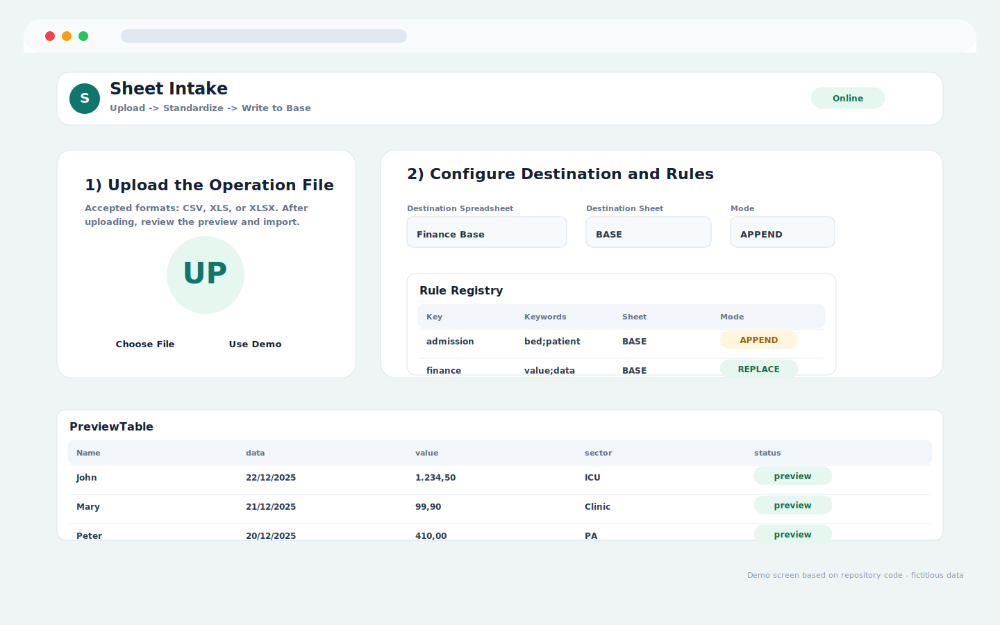
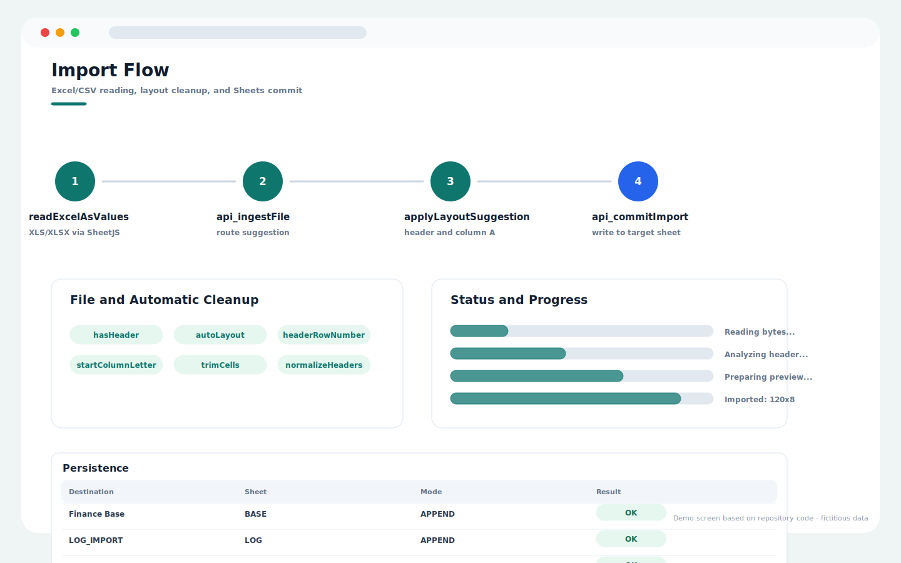

# Google Sheets Automation Tool

Repository: `google-sheets-automation-tool`

## Overview

Sheet Intake app for CSV, XLS, and XLSX upload, automatic cleanup, destination routing, preview, and Google Sheets import.

## Main Capabilities

- Drag-and-drop file intake with demo mode.
- Destination spreadsheet and target sheet selection.
- Rule registry for keyword-based routing.
- Preview table, layout detection, cleanup options, and import commit flow.

## Operating Flow

1. Upload or choose a demo file.
2. Review the detected layout and destination suggestion.
3. Adjust cleanup and routing settings if needed.
4. Import the standardized data into the selected Google Sheet.

## Visual System Guide

> The screens below are documentation mockups based on the components, labels, colors, and workflows found in this repository. All displayed data is fictitious and does not represent real patients, staff members, or institutions.

### Sheet Intake - upload and rules

### Sheet Intake - import flow

## Data Privacy

The repository documentation and guide images use fictitious sample data only.

## Technologies

- JavaScript
- HTML/CSS
- Google Apps Script
- Google Sheets

## Status

In development
